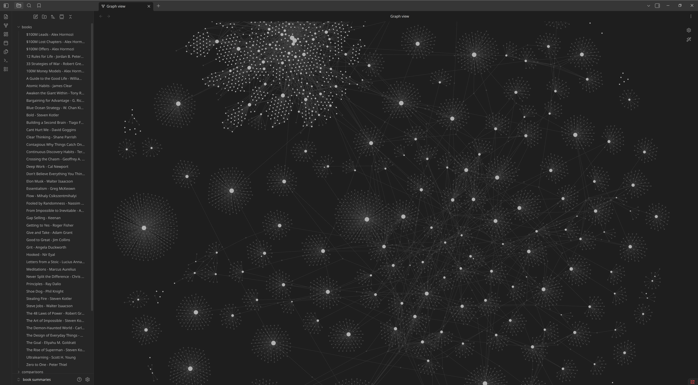

# book-llm-wiki

A three-stage pipeline for turning a shelf of books into an LLM-assisted
Obsidian wiki. Each stage is a Claude Code slash command; together they
move a book from an Amazon link (or LibraryThing catalog) to a compounding
cross-linked knowledge graph.

```
 /download-book  →  /ingest-book  →  /summarize-book
   Anna's Archive    EPUB → chapters    Opus 4.7 analysis
   + LibraryThing    + queue for        + Obsidian wiki
                     analysis
```

- **`/download-book`** — Claude Code agent that finds an EPUB on Anna's
  Archive, quality-checks it, and registers the book in LibraryThing.
- **`/ingest-book`** — thin wrapper over the Python CLI (`book_llm_wiki`)
  that converts EPUBs to chapter-structured markdown and queues them.
  Pure Python, no LLM calls.
- **`/summarize-book`** — Opus 4.7 runs chapter-parallel over the queue
  and writes a compounding Obsidian vault (summaries, concepts, entities,
  comparisons, verify-queries).



## Disclaimer

`/download-book` is intended for retrieving digital copies of books you
already legally own (e.g., a hardcover on your shelf, a Kindle purchase,
a library loan). Copyright law in your jurisdiction governs what you may
download; in many places format-shifting a book you own is a grey area
at best. You are solely responsible for ensuring your use complies with
applicable law and the terms of service of any source. The authors of
this project do not condone piracy and ship no content — the tool only
automates a search you could perform manually.

## Requirements

- Python 3.11+
- [Claude Code](https://claude.com/claude-code) — drives the slash commands.
- An Obsidian vault (or any directory) for the wiki output.
- **For `/download-book` only:**
  - [`annas-archive-mcp`](https://github.com/iamd3vil/annas-archive-mcp)
    server (`cargo install annas-archive-mcp`) — MCP config in
    `.claude/settings.local.json`.
  - A paid Anna's Archive "fast download" API key.
  - LibraryThing account (free).
  - `pip install -e ".[librarything]"` — installs `scrapling` for the
    LibraryThing browser automation.

## Install

```bash
git clone https://github.com/geoffreybyers/book-llm-wiki
cd book-llm-wiki
pip install -e ".[dev]"
# Optional: add ".[librarything]" if you want /download-book
cp books.yaml.example books.yaml
cp .env.example .env       # then fill in annas_api_key + LT creds (if using /download-book)
```

The slash commands (`/download-book`, `/ingest-book`, `/summarize-book`)
live at `.claude/commands/` and are auto-discovered by Claude Code when
you run it from this repo — no symlinks needed. If you want them
available globally, symlink the three files into `~/.claude/commands/`.

Edit `books.yaml` to point `vault_path` at your Obsidian vault. The
example paths (`~/obsidian/book summaries`, `./downloads/`) are
placeholders — replace with your own.

## Usage

From Claude Code:

```
/download-book "How to Win Friends and Influence People"
/ingest-book                                       # batch ingest ./downloads/
/ingest-book status
/summarize-book                                    # analyze next queued book
/summarize-book 3 --lens business                  # analyze next 3 with business lens
```

From the shell (bypasses Claude Code — useful for scripting and CI):

```bash
python -m book_llm_wiki ingest path/to/book.epub
python -m book_llm_wiki ingest --dir ./downloads/
python -m book_llm_wiki status
python -m book_llm_wiki reset "Deep Work - Cal Newport"
```

## Analysis model

See `docs/analysis-template.md` for the summary-page template and
`docs/lens-examples.md` for the built-in analytical lenses (general,
self-help, business, philosophy, memoir, fiction).

## License

MIT — see [LICENSE](LICENSE).
